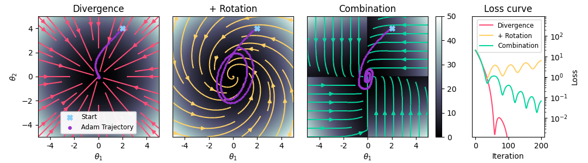

# Code repository for "Stabilizing Backpropagation Through Time to Learn Complex Physics" 

This repository contains the source code for the ICLR'24 paper on "Stabilizing Backpropagation Through Time to Learn Complex Physics" by [Patrick Schnell](https://ge.in.tum.de/about/patrick-schnell/) and [Nils Thuerey](https://ge.in.tum.de/about/n-thuerey/) from the [Physics-based Simulation Group, Technical University of Munich](https://ge.in.tum.de/).

[PDF at OpenReview](https://openreview.net/forum?id=bozbTTWcaw)




## Abstract:

Of all the vector fields surrounding the minima of recurrent learning setups, the gradient field with its exploding and vanishing updates appears a poor choice for optimization, offering little beyond efficient computability. We seek to improve this suboptimal practice in the context of physics simulations, where backpropagating feedback through many unrolled time steps is considered crucial to acquiring temporally coherent behavior. The alternative vector field we propose follows from two principles: physics simulators, unlike neural networks, have a balanced gradient flow and certain modifications to the backpropagation pass leave the positions of the original minima unchanged. As any modification of backpropagation decouples forward and backward pass, the rotation-free character of the gradient field is lost. Therefore, we discuss the negative implications of using such a rotational vector field for optimization and how to counteract them. Our final procedure is easily implementable via a sequence of gradient stopping and component-wise comparison operations, which do not negatively affect scalability. Our experiments on three control problems show that especially as we increase the complexity of each task, the unbalanced updates from the gradient can no longer provide the precise control signals necessary while our method still solves the tasks.


## Running the Code

We recommend installing the required packages with conda. 

```
conda env create -f conda_environment.yaml 
conda activate StableBPTT
```

To run, for instance, the CartPole experiments, go into the CartPole folder and run:

```
bash Runs/01/01.sh
python Plots/01/plot.py
```

